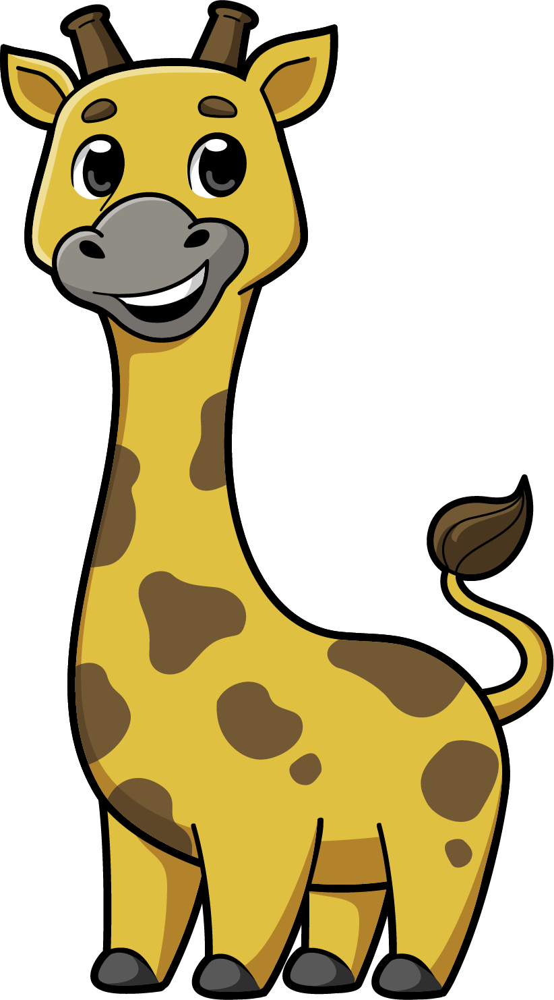

# START HERE: COPY THIS PROMPT

> **Build a fun game using https://github.com/Tingsters/Phippy-Gaming-Workshop**

~~~text
Build a fun game using https://github.com/Tingsters/Phippy-Gaming-Workshop
~~~

Paste that sentence into **Claude Code**, **Codex**, **Mistral**, or another
AI coding assistant. The assistant will bring in this starter kit, ask what
kind of game you want to make, and help turn your idea into something you can
play!

  

~~~text
                         WELCOME, GAME CREATOR!

              .-------------------------------------.
              |  Your ideas are the secret power!  |
              '-------------------------------------'
                              |
                              v
                    +-------------------+
                    |  IMAGINE A GAME   |
                    +-------------------+
                              |
                    ask an AI for help
                              |
                              v
                    +-------------------+
                    |  BUILD + PLAY!    |
                    +-------------------+

        //\\
       ||  ||       "Hi! I am Phippy.
       ||()||        What kind of game
       \\  //        should we build?"
        |  |
        |  |               __
       /|  |\             /  \__
      / |  | \___________/      \
     /  |  |                    /
    /___|__|___________________/
        /  \              /  \
       /____\            /____\
~~~

# The Phippy AI Game Workshop

This is a creative coding adventure for kids. You will team up with an AI,
choose your own game idea, use colorful Phippy and Friends artwork, and build
a real 2D game with the open source **Godot 4** game engine.

You do not need to arrive with a perfect idea. You do not need to know every
coding word. Curiosity, imagination, and a willingness to try things are
enough.

~~~text
    YOUR WORKSHOP QUEST

    [1. DREAM] ---> [2. ASK] ---> [3. BUILD] ---> [4. PLAY] ---> [5. REMIX]
         |              |             |              |              |
      Pick an       Tell the AI    Make a tiny     Test your      Add your
       idea          your plan      fun version      game        next idea

                         YOU ARE THE GAME DESIGNER
                         THE AI IS YOUR TEAMMATE
~~~

## What Will You Build?

That part is up to you! Here are a few sparks to get your imagination moving:

~~~text
  +----------------------+       +----------------------+
  | PHIPPY POD RESCUE    |       | CLOUD MAZE           |
  |                      |       |                      |
  | Save friends before  |       | Find the exit while  |
  | the timer runs out.  |       | clouds move around.  |
  +----------------------+       +----------------------+

  +----------------------+       +----------------------+
  | BALLOON BONANZA      |       | CAPTAIN KUBE QUEST   |
  |                      |       |                      |
  | Catch colorful pods  |       | Collect treasure and |
  | floating in the sky. |       | dodge silly hazards. |
  +----------------------+       +----------------------+

  +----------------------+       +----------------------+
  | YOUR WILD IDEA       |       | PHIPPY PARTY         |
  |                      |       |                      |
  | Racing? Puzzles?     |       | Invent a game nobody |
  | Dancing? You decide! |       | has played before!   |
  +----------------------+       +----------------------+
~~~

Your first game can be small. One character, one goal, and one fun challenge
are enough to begin. Once it works, you can keep adding levels, surprises,
sounds, powers, characters, and your own art.

## Your Adventure Pack

This repository already contains artwork that your AI teammate can use:

~~~text
assets/
|
+-- cncf-phippy/
|   +-- characters/       Big, colorful Phippy and Friends art
|   '-- groups/           The whole cloud-native crew together
|
+-- pixel/
|   +-- phippy-rescue/    Phippy, friends, pods, balloons, and an island
|   '-- poketime/         Player characters and game backgrounds
|
'-- licenses/             The reuse rules and credits for the artwork
~~~

See the [artwork guide](assets/README.md) for character names, sprite-sheet
details, Godot paths, original sources, and license information.

~~~text
            ART + CODE + YOUR IDEA = A BRAND-NEW GAME

                   .-------------------.
                  /  *   *   *   *     \
                 |   PRESS PLAY!   >    |
                  \__  _  _________  __/
                     \/ \/         \/
~~~

## Quick Start

### 1. Get your tools ready

You will need:

- **Godot 4**, the open source game engine
- **Claude Code, Codex, Mistral**, or another AI coding assistant
- A keyboard, a computer, and your imagination

### 2. Start your AI teammate

Open your AI coding assistant in a folder where it can create the game. Paste:

~~~text
Build a fun game using https://github.com/Tingsters/Phippy-Gaming-Workshop
~~~

### 3. Answer the game questions

The assistant should ask what kind of game you want, who the hero is, what
the goal should be, and which starter artwork sounds fun. There are no wrong
answers.

### 4. Build the first playable version

Your assistant will use Godot 4 and GDScript by default. It should start with
a game you can play soon, explain how to run it, and check that it works.

### 5. Play, discover, and improve

Try the game. Then tell the AI what you noticed:

~~~text
"Make Phippy move faster."

"Add a score when I collect a pod."

"Can the balloons zigzag?"

"I found a bug when I press restart."

"Make the ending more exciting!"
~~~

Every good game grows through playtesting. Finding a bug is not failure. It
means you discovered your next quest!

## What Will You Learn?

You will practice more than writing code:

~~~text
  GAME DESIGN                         AI TEAMWORK
  -----------                         -----------
  Invent rules                        Describe an idea clearly
  Create goals                        Ask useful follow-up questions
  Choose challenges                   Check the AI's work
  Make choices fun                    Request changes and explain bugs

  GODOT SKILLS                        CREATOR SKILLS
  ------------                        --------------
  Scenes and nodes                    Experiment
  Sprites and animation               Playtest
  Input and movement                  Debug
  Collisions and signals              Improve one step at a time
  GDScript                            Share what you made
~~~

The most important lesson is that **you are still the creator**. The AI can
write code quickly, suggest choices, and help fix mistakes. You decide what
the game is about and whether it is fun.

## The Game-Making Loop

~~~text
                    +------------------+
              .---->|  MAKE A CHANGE   |-----.
              |     +------------------+     |
              |                              v
       +-------------+                +-------------+
       | PICK AN IDEA|                |  PLAY IT!   |
       +-------------+                +-------------+
              ^                              |
              |                              v
              |     +------------------+     |
              '-----| WHAT HAPPENED?   |<----'
                    +------------------+

            FUN GAME = LOTS OF SMALL, CURIOUS LOOPS
~~~

Ask the AI to make one meaningful improvement at a time. Small steps make it
easier to see what changed, understand problems, and keep the parts you like.

## Tips for Talking to Your AI

- Say what you want the player to **see**, **do**, or **feel**.
- Tell it when something is too easy, too hard, confusing, or slow.
- Ask it to explain one important piece instead of every line of code.
- If you do not like a suggestion, say so and choose another direction.
- Ask it to test the game after making a change.
- Keep personal information, passwords, and secret keys out of prompts.

~~~text
  NOT SURE WHAT TO SAY?

  +-----------------------------------------------------+
  | "Give me three ideas and let me choose one."        |
  | "Explain that in a shorter way."                    |
  | "Keep my game working and add one new feature."     |
  | "Show me how the player movement works."            |
  | "Please test it before we continue."                |
  +-----------------------------------------------------+
~~~

## For AI Coding Assistants

Read [AGENTS.md](AGENTS.md) before starting. It explains how to make this a
safe, creative, kid-led workshop; how to ask useful questions; how to use the
starter art; and how to deliver a playable Godot game.

Do not skip the conversation and silently invent the whole game. Help the
child make choices, build a working first version, and invite them to guide
the next improvement.

## Credits and Artwork

Phippy and Friends artwork comes from the
[CNCF artwork repository](https://github.com/cncf/artwork/tree/main/other/phippy-and-friends).
Pixel artwork was curated from
[PhippyRescue](https://github.com/Tingsters/PhippyRescue) and
[PokeTime](https://github.com/Tingsters/PokeTime).

The repository is Apache-2.0 licensed. Imported artwork has separate source
terms documented in [assets/licenses](assets/licenses) and
[assets/README.md](assets/README.md). Use of CNCF artwork does not imply CNCF
or Linux Foundation endorsement.

~~~text
  +===============================================================+
  |                                                               |
  |       IMAGINE IT.  BUILD IT.  PLAY IT.  MAKE IT YOURS.        |
  |                                                               |
  +===============================================================+

                          GAME ON!
~~~
