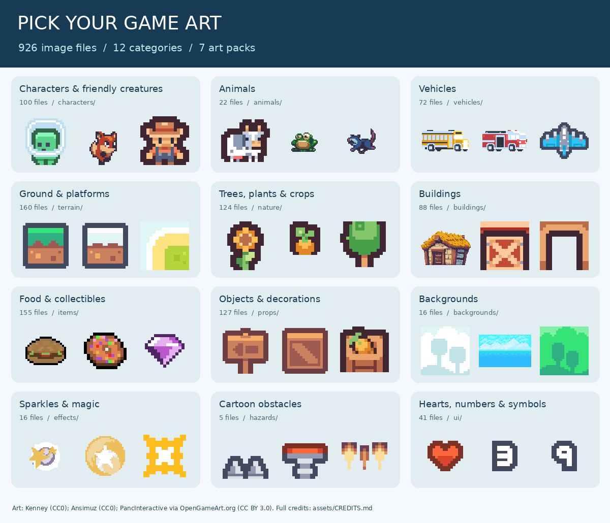

# Pick your game artwork

Choose a folder, open its picture guide, and pick something fun!



This collection adds **926 PNG image files** from seven art packs. There are individual sprites, tiles, animation frames, and 17 verified sprite sheets.

| What do you need? | Folder | Files |
| --- | --- | ---: |
| Characters & friendly creatures | [characters/](characters/README.md) | 100 |
| Animals | [animals/](animals/README.md) | 22 |
| Vehicles | [vehicles/](vehicles/README.md) | 72 |
| Ground & platforms | [terrain/](terrain/README.md) | 160 |
| Trees, plants & crops | [nature/](nature/README.md) | 124 |
| Buildings | [buildings/](buildings/README.md) | 88 |
| Food & collectibles | [items/](items/README.md) | 155 |
| Objects & decorations | [props/](props/README.md) | 127 |
| Backgrounds | [backgrounds/](backgrounds/README.md) | 16 |
| Sparkles & magic | [effects/](effects/README.md) | 16 |
| Cartoon obstacles | [hazards/](hazards/README.md) | 5 |
| Hearts, numbers & symbols | [ui/](ui/README.md) | 41 |

## Try an idea

- "Make a farm game where I grow carrots and look after a cow."
- "Make a delivery game with a school bus and a little town."
- "Make a fox jumping game where I collect cherries."
- "Make a flying game where I explore islands and collect gems."

## Finding matching art

Inside each category, files are grouped by the original art pack. Pick the same pack for a matching look. The picture guides show filenames and sizes. A number at the end of a tile name identifies its original tile in the pack.

- **Pixel Platformer:** 18 x 18 ground tiles; 24 x 24 characters and background tiles.
- **Tiny Town and Tiny Farm:** 16 x 16 tiles in a compatible small style.
- **Pixel Shmup:** 16 x 16 terrain and icons; 32 x 32 flying vehicles.
- **Pixel Vehicle Pack, food, and SunnyLand:** varied image sizes; see each picture guide.

For moving characters and effects, use the [animation guide](ANIMATIONS.md).

Phippy and the existing workshop artwork are still listed in the [main artwork guide](../README.md).

## For game builders

Use the individual PNGs directly in Godot. For example:

```text
res://assets/pixel/vehicles/pixel-vehicle-pack/school-bus.png
res://assets/pixel/animals/tiny-farm/cow-0121.png
```

Set CanvasItem texture filtering to **Nearest** for crisp pixels and scale sprites by whole numbers when practical. These files keep their original pixels and dimensions. Most tiny terrain pieces are tiles, not full backgrounds. The manifest lists image sizes; it does not define collisions or Godot TileSet terrain rules.

The [manifest](manifest.json) maps every new image to its original filename, source pack, size, and SHA-256 checksum. [Source details](../sources.json) record download URLs, versions, license IDs, and archive checksums.

## Credits travel with the artwork

See [CREDITS.md](../CREDITS.md) for creator names, source links, and reuse rules. Food from Crosstown Smash requires attribution in games that use it. The remaining new packs use CC0; voluntary credits are included too. The repository's Apache-2.0 license does not replace the artwork licenses.
