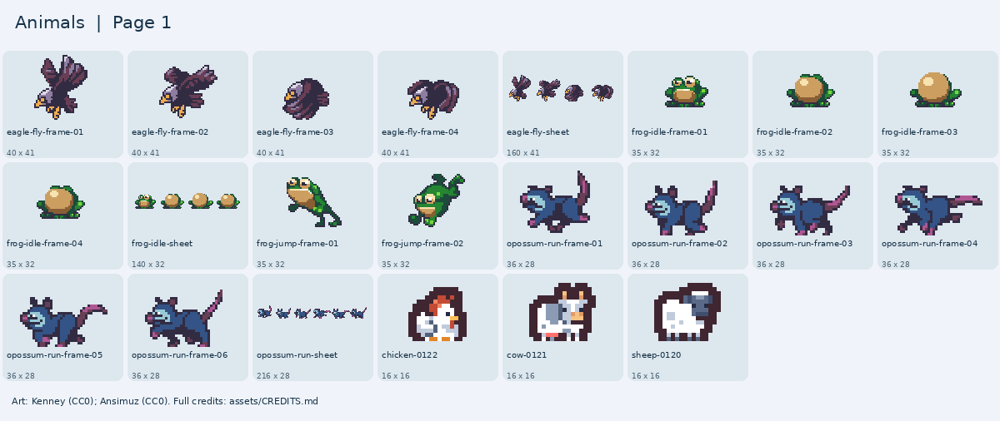

# Animals

Sheep, cow, chicken, frog, eagle, and opossum.

[Back to all artwork](../README.md)

**22 PNG files.** Pick a picture below, then find its filename in the list.

Keep images from the same pack together when you want a matching look. Sizes are the original pixel sizes.

## Picture guide 1

Open the filenames and download links

| File | Pack | Pixels | Kind |
| --- | --- | --- | --- |
| [sunnyland/eagle-fly-frame-01.png](sunnyland/eagle-fly-frame-01.png) | SunnyLand | 40 x 41 | animation frame |
| [sunnyland/eagle-fly-frame-02.png](sunnyland/eagle-fly-frame-02.png) | SunnyLand | 40 x 41 | animation frame |
| [sunnyland/eagle-fly-frame-03.png](sunnyland/eagle-fly-frame-03.png) | SunnyLand | 40 x 41 | animation frame |
| [sunnyland/eagle-fly-frame-04.png](sunnyland/eagle-fly-frame-04.png) | SunnyLand | 40 x 41 | animation frame |
| [sunnyland/eagle-fly-sheet.png](sunnyland/eagle-fly-sheet.png) | SunnyLand | 160 x 41 | sprite sheet |
| [sunnyland/frog-idle-frame-01.png](sunnyland/frog-idle-frame-01.png) | SunnyLand | 35 x 32 | animation frame |
| [sunnyland/frog-idle-frame-02.png](sunnyland/frog-idle-frame-02.png) | SunnyLand | 35 x 32 | animation frame |
| [sunnyland/frog-idle-frame-03.png](sunnyland/frog-idle-frame-03.png) | SunnyLand | 35 x 32 | animation frame |
| [sunnyland/frog-idle-frame-04.png](sunnyland/frog-idle-frame-04.png) | SunnyLand | 35 x 32 | animation frame |
| [sunnyland/frog-idle-sheet.png](sunnyland/frog-idle-sheet.png) | SunnyLand | 140 x 32 | sprite sheet |
| [sunnyland/frog-jump-frame-01.png](sunnyland/frog-jump-frame-01.png) | SunnyLand | 35 x 32 | animation frame |
| [sunnyland/frog-jump-frame-02.png](sunnyland/frog-jump-frame-02.png) | SunnyLand | 35 x 32 | animation frame |
| [sunnyland/opossum-run-frame-01.png](sunnyland/opossum-run-frame-01.png) | SunnyLand | 36 x 28 | animation frame |
| [sunnyland/opossum-run-frame-02.png](sunnyland/opossum-run-frame-02.png) | SunnyLand | 36 x 28 | animation frame |
| [sunnyland/opossum-run-frame-03.png](sunnyland/opossum-run-frame-03.png) | SunnyLand | 36 x 28 | animation frame |
| [sunnyland/opossum-run-frame-04.png](sunnyland/opossum-run-frame-04.png) | SunnyLand | 36 x 28 | animation frame |
| [sunnyland/opossum-run-frame-05.png](sunnyland/opossum-run-frame-05.png) | SunnyLand | 36 x 28 | animation frame |
| [sunnyland/opossum-run-frame-06.png](sunnyland/opossum-run-frame-06.png) | SunnyLand | 36 x 28 | animation frame |
| [sunnyland/opossum-run-sheet.png](sunnyland/opossum-run-sheet.png) | SunnyLand | 216 x 28 | sprite sheet |
| [tiny-farm/chicken-0122.png](tiny-farm/chicken-0122.png) | Kenney Tiny Farm | 16 x 16 | tile |
| [tiny-farm/cow-0121.png](tiny-farm/cow-0121.png) | Kenney Tiny Farm | 16 x 16 | tile |
| [tiny-farm/sheep-0120.png](tiny-farm/sheep-0120.png) | Kenney Tiny Farm | 16 x 16 | tile |

## Credits

Keep [the relevant credits](../../CREDITS.md) with artwork you copy into a game.

- [SunnyLand](https://ansimuz.itch.io/sunny-land-pixel-game-art) — Luis Zuno (Ansimuz); [CC0-1.0](https://creativecommons.org/publicdomain/zero/1.0/).
- [Kenney Tiny Farm](https://kenney.nl/assets/tiny-farm) — Kenney; [CC0-1.0](https://creativecommons.org/publicdomain/zero/1.0/).

For moving pictures, see the [animation guide](../ANIMATIONS.md).
