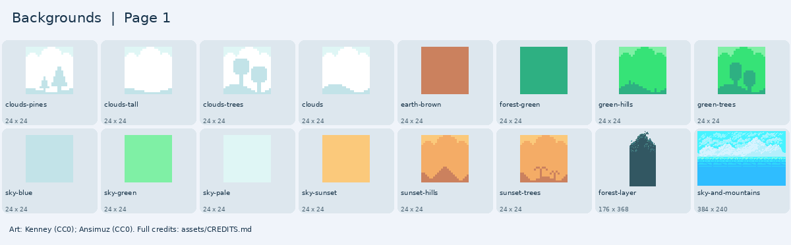

# Backgrounds

Sky colors, clouds, hills, mountains, and a forest layer.

[Back to all artwork](../README.md)

**16 PNG files.** Pick a picture below, then find its filename in the list.

Keep images from the same pack together when you want a matching look. Sizes are the original pixel sizes.

## Picture guide 1

Open the filenames and download links

| File | Pack | Pixels | Kind |
| --- | --- | --- | --- |
| [pixel-platformer/clouds-pines.png](pixel-platformer/clouds-pines.png) | Kenney Pixel Platformer | 24 x 24 | background tile |
| [pixel-platformer/clouds-tall.png](pixel-platformer/clouds-tall.png) | Kenney Pixel Platformer | 24 x 24 | background tile |
| [pixel-platformer/clouds-trees.png](pixel-platformer/clouds-trees.png) | Kenney Pixel Platformer | 24 x 24 | background tile |
| [pixel-platformer/clouds.png](pixel-platformer/clouds.png) | Kenney Pixel Platformer | 24 x 24 | background tile |
| [pixel-platformer/earth-brown.png](pixel-platformer/earth-brown.png) | Kenney Pixel Platformer | 24 x 24 | background tile |
| [pixel-platformer/forest-green.png](pixel-platformer/forest-green.png) | Kenney Pixel Platformer | 24 x 24 | background tile |
| [pixel-platformer/green-hills.png](pixel-platformer/green-hills.png) | Kenney Pixel Platformer | 24 x 24 | background tile |
| [pixel-platformer/green-trees.png](pixel-platformer/green-trees.png) | Kenney Pixel Platformer | 24 x 24 | background tile |
| [pixel-platformer/sky-blue.png](pixel-platformer/sky-blue.png) | Kenney Pixel Platformer | 24 x 24 | background tile |
| [pixel-platformer/sky-green.png](pixel-platformer/sky-green.png) | Kenney Pixel Platformer | 24 x 24 | background tile |
| [pixel-platformer/sky-pale.png](pixel-platformer/sky-pale.png) | Kenney Pixel Platformer | 24 x 24 | background tile |
| [pixel-platformer/sky-sunset.png](pixel-platformer/sky-sunset.png) | Kenney Pixel Platformer | 24 x 24 | background tile |
| [pixel-platformer/sunset-hills.png](pixel-platformer/sunset-hills.png) | Kenney Pixel Platformer | 24 x 24 | background tile |
| [pixel-platformer/sunset-trees.png](pixel-platformer/sunset-trees.png) | Kenney Pixel Platformer | 24 x 24 | background tile |
| [sunnyland/forest-layer.png](sunnyland/forest-layer.png) | SunnyLand | 176 x 368 | background |
| [sunnyland/sky-and-mountains.png](sunnyland/sky-and-mountains.png) | SunnyLand | 384 x 240 | background |

## Credits

Keep [the relevant credits](../../CREDITS.md) with artwork you copy into a game.

- [Kenney Pixel Platformer](https://kenney.nl/assets/pixel-platformer) — Kenney; [CC0-1.0](https://creativecommons.org/publicdomain/zero/1.0/).
- [SunnyLand](https://ansimuz.itch.io/sunny-land-pixel-game-art) — Luis Zuno (Ansimuz); [CC0-1.0](https://creativecommons.org/publicdomain/zero/1.0/).

Most Kenney backgrounds are 24 x 24 tiles to repeat across the screen. SunnyLand has larger scene layers.
