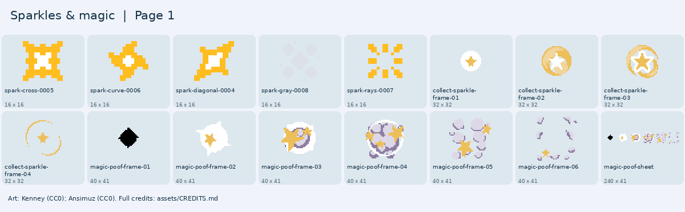

# Sparkles & magic

Glowing sparks, a magic poof, and a collectible sparkle.

[Back to all artwork](../README.md)

**16 PNG files.** Pick a picture below, then find its filename in the list.

Keep images from the same pack together when you want a matching look. Sizes are the original pixel sizes.

## Picture guide 1

Open the filenames and download links

| File | Pack | Pixels | Kind |
| --- | --- | --- | --- |
| [pixel-shmup/spark-cross-0005.png](pixel-shmup/spark-cross-0005.png) | Kenney Pixel Shmup | 16 x 16 | tile |
| [pixel-shmup/spark-curve-0006.png](pixel-shmup/spark-curve-0006.png) | Kenney Pixel Shmup | 16 x 16 | tile |
| [pixel-shmup/spark-diagonal-0004.png](pixel-shmup/spark-diagonal-0004.png) | Kenney Pixel Shmup | 16 x 16 | tile |
| [pixel-shmup/spark-gray-0008.png](pixel-shmup/spark-gray-0008.png) | Kenney Pixel Shmup | 16 x 16 | tile |
| [pixel-shmup/spark-rays-0007.png](pixel-shmup/spark-rays-0007.png) | Kenney Pixel Shmup | 16 x 16 | tile |
| [sunnyland/collect-sparkle-frame-01.png](sunnyland/collect-sparkle-frame-01.png) | SunnyLand | 32 x 32 | animation frame |
| [sunnyland/collect-sparkle-frame-02.png](sunnyland/collect-sparkle-frame-02.png) | SunnyLand | 32 x 32 | animation frame |
| [sunnyland/collect-sparkle-frame-03.png](sunnyland/collect-sparkle-frame-03.png) | SunnyLand | 32 x 32 | animation frame |
| [sunnyland/collect-sparkle-frame-04.png](sunnyland/collect-sparkle-frame-04.png) | SunnyLand | 32 x 32 | animation frame |
| [sunnyland/magic-poof-frame-01.png](sunnyland/magic-poof-frame-01.png) | SunnyLand | 40 x 41 | animation frame |
| [sunnyland/magic-poof-frame-02.png](sunnyland/magic-poof-frame-02.png) | SunnyLand | 40 x 41 | animation frame |
| [sunnyland/magic-poof-frame-03.png](sunnyland/magic-poof-frame-03.png) | SunnyLand | 40 x 41 | animation frame |
| [sunnyland/magic-poof-frame-04.png](sunnyland/magic-poof-frame-04.png) | SunnyLand | 40 x 41 | animation frame |
| [sunnyland/magic-poof-frame-05.png](sunnyland/magic-poof-frame-05.png) | SunnyLand | 40 x 41 | animation frame |
| [sunnyland/magic-poof-frame-06.png](sunnyland/magic-poof-frame-06.png) | SunnyLand | 40 x 41 | animation frame |
| [sunnyland/magic-poof-sheet.png](sunnyland/magic-poof-sheet.png) | SunnyLand | 240 x 41 | sprite sheet |

## Credits

Keep [the relevant credits](../../CREDITS.md) with artwork you copy into a game.

- [Kenney Pixel Shmup](https://kenney.nl/assets/pixel-shmup) — Kenney; [CC0-1.0](https://creativecommons.org/publicdomain/zero/1.0/).
- [SunnyLand](https://ansimuz.itch.io/sunny-land-pixel-game-art) — Luis Zuno (Ansimuz); [CC0-1.0](https://creativecommons.org/publicdomain/zero/1.0/).

For moving pictures, see the [animation guide](../ANIMATIONS.md).
