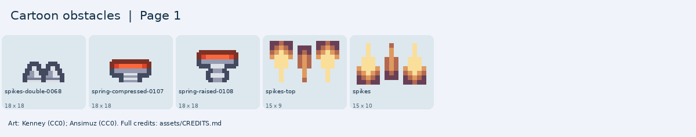

# Cartoon obstacles

Spikes and springs for jumping and bouncing games.

[Back to all artwork](../README.md)

**5 PNG files.** Pick a picture below, then find its filename in the list.

Keep images from the same pack together when you want a matching look. Sizes are the original pixel sizes.

## Picture guide 1

Open the filenames and download links

| File | Pack | Pixels | Kind |
| --- | --- | --- | --- |
| [pixel-platformer/spikes-double-0068.png](pixel-platformer/spikes-double-0068.png) | Kenney Pixel Platformer | 18 x 18 | tile |
| [pixel-platformer/spring-compressed-0107.png](pixel-platformer/spring-compressed-0107.png) | Kenney Pixel Platformer | 18 x 18 | tile |
| [pixel-platformer/spring-raised-0108.png](pixel-platformer/spring-raised-0108.png) | Kenney Pixel Platformer | 18 x 18 | tile |
| [sunnyland/spikes-top.png](sunnyland/spikes-top.png) | SunnyLand | 15 x 9 | sprite |
| [sunnyland/spikes.png](sunnyland/spikes.png) | SunnyLand | 15 x 10 | sprite |

## Credits

Keep [the relevant credits](../../CREDITS.md) with artwork you copy into a game.

- [Kenney Pixel Platformer](https://kenney.nl/assets/pixel-platformer) — Kenney; [CC0-1.0](https://creativecommons.org/publicdomain/zero/1.0/).
- [SunnyLand](https://ansimuz.itch.io/sunny-land-pixel-game-art) — Luis Zuno (Ansimuz); [CC0-1.0](https://creativecommons.org/publicdomain/zero/1.0/).
